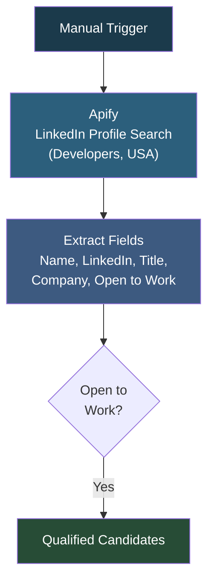

# Recruitment Flow

## Overview

A LinkedIn candidate sourcing workflow using Apify's LinkedIn Profile Search Scraper. It searches for developers in the USA with 3+ years of experience, extracts profile details (name, headline, LinkedIn URL, company, location, open-to-work status), and filters for candidates who are actively open to work. This provides a quick way to find available talent for recruitment pipelines.

## How It Works

```
Manual Trigger -> Apify LinkedIn Profile Search (Developers, USA, 3+ years) -> Extract fields (name, LinkedIn, title, company, location, open to work) -> Filter: Open to Work = true
```

### Workflow Diagram



## Integrations

- **Apify** - LinkedIn Profile Search Scraper (no cookies required)

## Setup

1. Import `Recuritment_Flow.json` into your n8n instance.
2. Configure Apify OAuth2 credentials.
3. Customize the search criteria (job titles, locations, experience level) in the actor input.
4. Execute manually.
